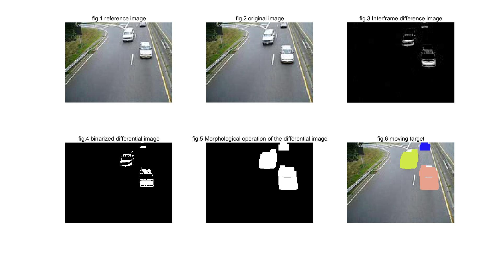
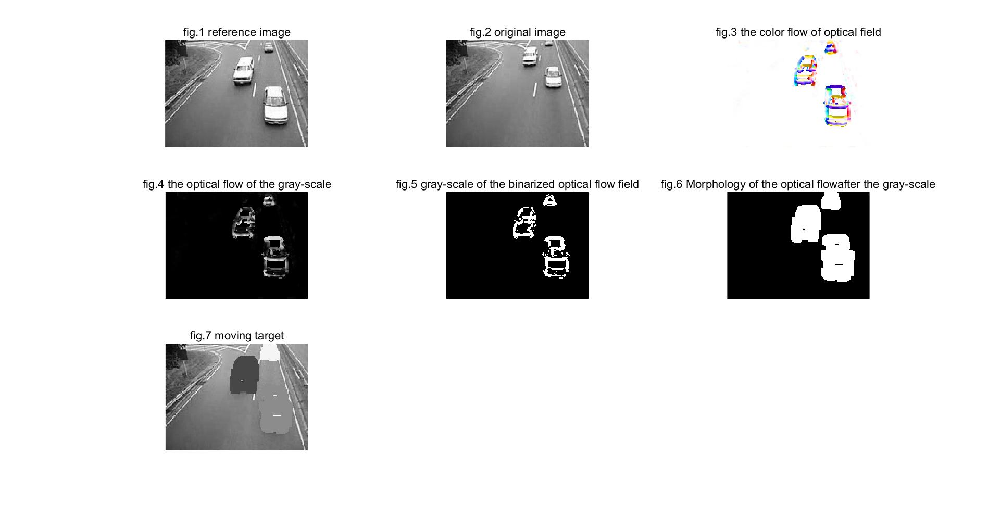
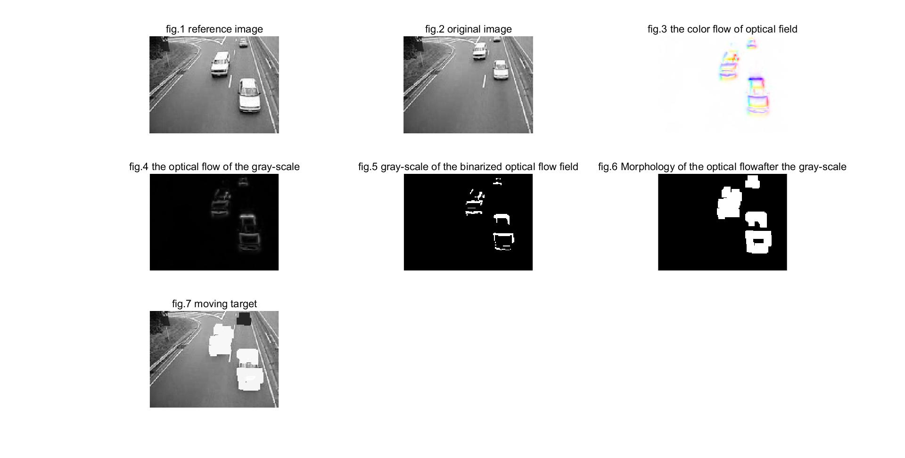

#moving_target_segment
##运动目标分割

images文件夹内为所使用的数据，本实验选择使用traffic文件夹内的9帧图片

帧间差分法代码包括两项：
1. demo.m 
  可以通过修改k值选择所标记的参考图片序号，二值化阈值threshold设置为50
2. mark.m 
  实现在原图像上标记一帧的分割结果

光流法（包括Horn-Schunck算法和Lucas-Kanade算法）代码包括三项：
1. demo.m
  Horn-Schunck方法阈值设置为0.5，默认阈值为1
  Lucas-Kanade方法阈值设置为0.01，默认阈值为0.0039
2. computeColor.m 
  计算彩色光流场
3. mark.m 
  实现在原图像上标记一帧的分割结果

### 实验结果

####帧间差分法

####Horn-Schunck光流算法

####Lucas-Kanade光流算法

